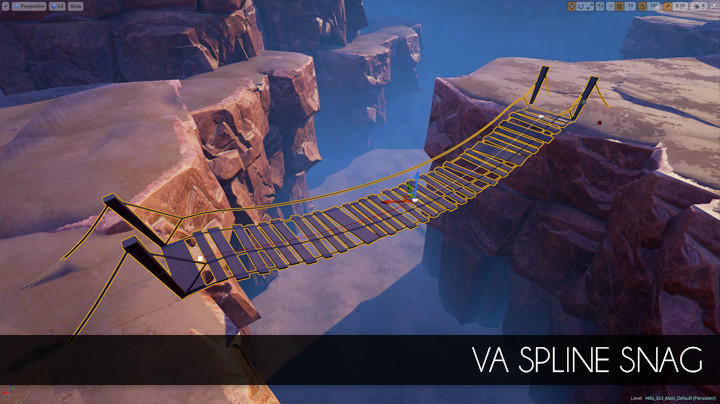

Overview
========

**VaSplineSnag** is the content project with a **spline tool** provided for level designers who works with [Unreal Engine 4](https://www.unrealengine.com/).

Key features:

* Various ways of application: cliffs, roads, fences, bridges and lots more!
* Uses **instanced mesh** technology for performance consideration
* Flexible spline controls: uniform distribution, **curving along spline**, local transform support, etc.
* Built-in **terrain snapping** to make fence and roads creation even more easier

Current version: **1.0 RC 1** (tested for UE 4.9-4.10)

Legal info
----------

Unreal® is a trademark or registered trademark of Epic Games, Inc. in the United States of America and elsewhere.

Unreal® Engine, Copyright 1998 – 2014, Epic Games, Inc. All rights reserved.
